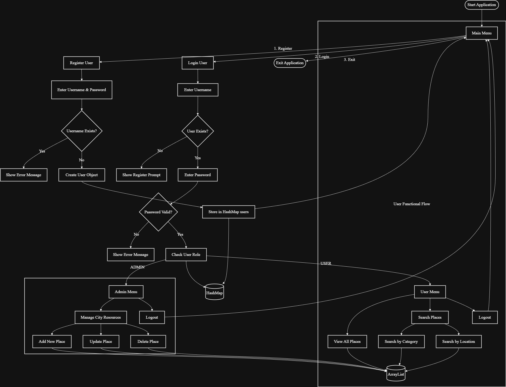

# Smart City Guide 🏙️

Welcome to the **Smart City Guide**, a console-based Java application designed to help users explore and navigate city attractions efficiently. This project simulates a smart city environment where users can search for places, and administrators can manage city resources.



## 📖 Table of Contents
- [Overview](#overview)
- [Features](#features)
  - [User Features](#user-features)
  - [Admin Features](#admin-features)
- [Project Structure](#project-structure)
- [Getting Started](#getting-started)
- [Technology Stack](#technology-stack)

## Overview
The Smart City Guide is an interactive CLI tool that allows residents and tourists to discover various locations such as hotels, restaurants, parks, and museums. It features a robust user authentication system with distinct roles for **Users** and **Admins**.

> **Note:** The application currently uses in-memory storage, meaning data is reset when the application restarts.

## Features

### User Features 👤
- **Registration & Login**: Secure account creation and access.
- **View Attractions**: Browse a curated list of city places.
- **Search Functionality**: 
  - 🔍 **Search by Category**: Find specific types of places (e.g., "Restaurant", "Park").
  - 📍 **Search by Location**: Find places in specific areas (e.g., "Downtown", "Main Street").
- **Navigation & Services**: (Simulated) Access options for nearby services and navigation.

### Admin Features 🛠️
- **Resource Management**: Complete control over the city's place database.
  - ➕ **Add New Place**: Register new locations with details like name, category, and description.
  - ✏️ **Update Place**: Modify details of existing places.
  - ❌ **Delete Place**: Remove outdated or closed locations.
- **System Monitoring**: Access to system logs and user views (Simulated).

## Project Structure
The project follows a clean MVC-like architecture (Model-View-Controller) adapted for a console app:

```
SmartCityGuide/
├── Assets/                 # Project assets and diagrams
│   └── SmartCity.drawio.png
├── src/
│   └── com/
│       └── smartcity/
│           ├── main/
│           │   └── SmartCityApp.java  # Main entry point and application logic
│           └── model/
│               ├── Place.java         # Data model for city places
│               └── User.java          # Data model for user accounts
├── README.md               # Project documentation
└── .gitignore
```

### Key Classes
- **`SmartCityApp.java`**: Handles the main execution loop, user input, menu display, and feature routing. It acts as the controller.
- **`Place.java`**: A POJO (Plain Old Java Object) representing a physical location with ID, name, category, and description.
- **`User.java`**: Represents a system user with credentials and role-based access control.

## Getting Started

### Prerequisites
- Java Development Kit (JDK) 8 or higher.
- A terminal or IDE (like IntelliJ IDEA, Eclipse, or VS Code).

### How to Run
1. **Clone the repository** (or download the source code).
2. **Navigate to the source directory**:
   ```bash
   cd SmartCityGuide/src
   ```
3. **Compile the Java files**:
   ```bash
   javac com/smartcity/main/SmartCityApp.java
   ```
4. **Run the application**:
   ```bash
   java com.smartcity.main.SmartCityApp
   ```

## Technology Stack
- **Language**: Java ☕
- **Interface**: Command Line Interface (CLI)
- **Data Storage**: In-Memory Data Structures (`HashMap`, `ArrayList`)

---
*Developed as part of the Creative Coding Progress series.*
