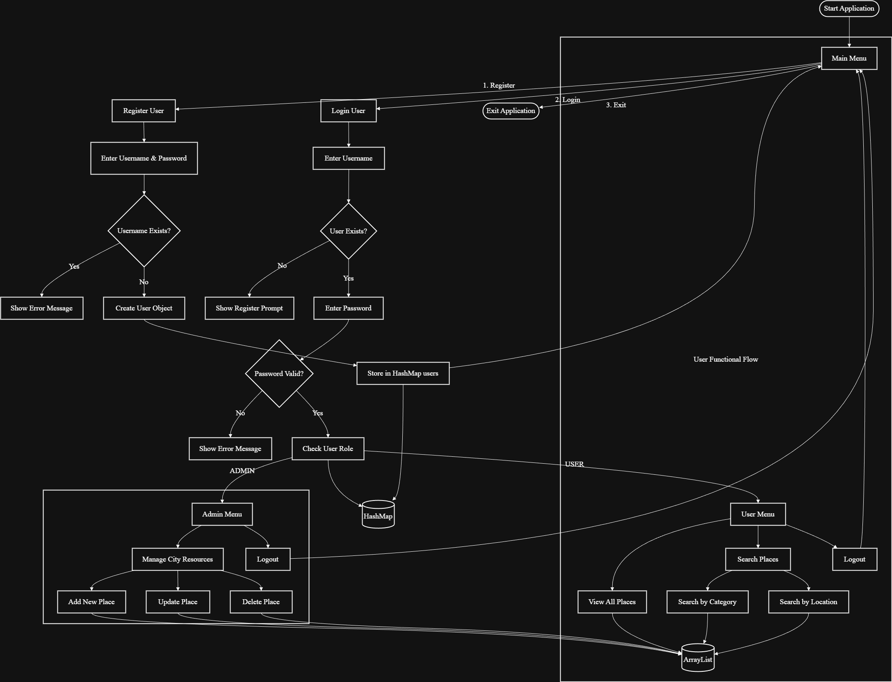

<div align="center">



# Smart City Guide - Learn Java, DSA, and System Architecture

**An open-source, interactive Java application designed to help beginners master Data Structures, Algorithms, and System Architecture through real-world contributions.**

[](https://www.java.com/)
[](https://www.mysql.com/)
[]()

[**Explore Features**](#features) • [**Getting Started**](#getting-started) • [**DSA Learning Program**](#dsa-learning-program)

</div>

## About The Project

**Smart City Guide** is the premier open-source Java starting contribution project for beginners and intermediate developers. It provides a beginner-friendly environment to learn Java, Data Structures and Algorithms (DSA), and backend database integration (JDBC/MySQL) through real-world features. By contributing to this robust, console-based city management simulator, you will gain practical, hands-on experience perfect for your first open-source pull requests.

## Features

### For Users & Admins
- **Interactive Navigation:** Search and discover city attractions, restaurants, and parks.
- **Role-Based Access Control (RBAC):** Secure authentication for users and administrators.
- **Dynamic Data Management:** Admins can easily add, update, or remove city locations.
- **Advanced Searching:** Filter places by specific categories or geographical locations.

### For Developers & Contributors
- **Real-World DSA:** Apply concepts like HashMaps, Tries, and Dijkstra's algorithm to build actual features like caching and routing.
- **Monolithic to MVC Migration:** Participate in our active architectural refactoring.
- **Comprehensive Testing:** Learn to write and maintain robust JUnit tests.

## Getting Started

> [!NOTE]
> This application requires a local or containerized **MySQL Database** for persistent storage.

### Local Setup

Ensure you have **Java JDK 8+** and **MySQL Server** installed. You will also need the `mysql-connector-java.jar` in your classpath.

1. **Initialize the Database:**
   ```bash
   mysql -u root -p < db_setup.sql
   ```
2. **Clone and Run:**
   ```bash
   git clone https://github.com/Rajath2005/SmartCityApp.git
   cd SmartCityApp/src
   javac com/smartcity/main/SmartCityApp.java
   java com.smartcity.main.SmartCityApp
   ```

### Docker Setup

For a seamless experience without local dependencies, use Docker Compose:

```bash
git clone https://github.com/Rajath2005/SmartCityApp.git
cd SmartCityApp
docker compose run --rm app
```

## Architecture

The project currently utilizes a monolithic architecture, making it highly accessible for beginners understanding core Java flows.

```text
SmartCityGuide/
├── Assets/                 # Diagrams and static assets
├── src/com/smartcity/      # Core Java Application
│   ├── main/               # Controllers and CLI UI logic
│   ├── model/              # Data models (POJOs)
│   └── db/                 # JDBC Connection Managers
├── web/                    # Frontend contributor portal
├── db_setup.sql            # Database schema and seed data
└── docker-compose.yml      # Container orchestration
```

## DSA Learning Program

SmartCityApp is uniquely designed to bridge the gap between algorithmic theory and practical application. We connect standard coding problems (e.g., from LeetCode or HackerRank) directly to feature implementations in the app.

> [!TIP]
> **Ready to level up your Java skills?**
> Start with the [DSA Master Guide](DSA_MASTER_GUIDE.md) to join the program. You will learn to implement custom comparators, command patterns, LRU caches, and complex graph routing.

*For contribution guidelines, code of conduct, and licensing information, please refer to the respective files in the repository root.*
