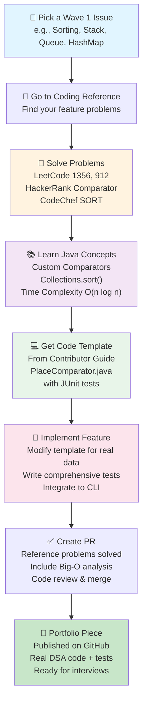
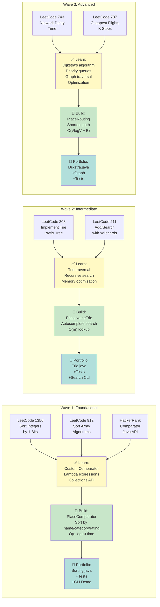
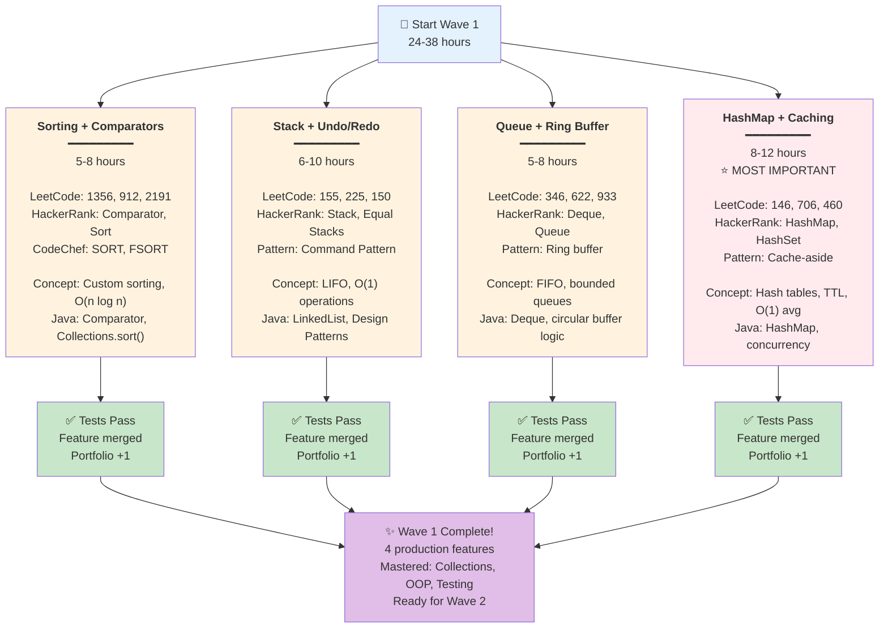
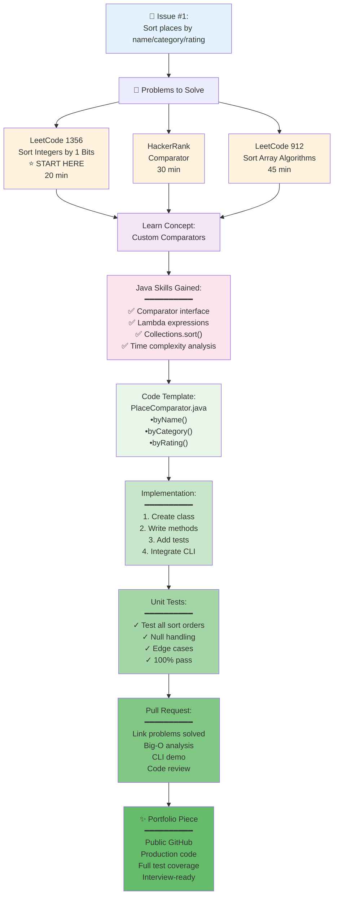
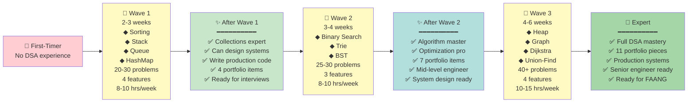

<div align="center">

<!-- Banner -->


<br/>

# 🏙️ Smart City Guide

### *Your intelligent companion to explore, navigate, and discover the city*

<br/>

[](https://www.java.com/)
[](https://www.mysql.com/)
[]()
[](LICENSE)
[](https://github.com/Rajath2005/SmartCityApp/pulls)
[](https://github.com/Rajath2005/SmartCityApp/graphs/contributors)

<br/>

[🚀 Get Started](#-getting-started) &nbsp;|&nbsp;
[✨ Features](#-features) &nbsp;|&nbsp;
[🏗️ Architecture](#️-architecture--project-structure) &nbsp;|&nbsp;
[🎓 DSA Program](#-dsa-learning-program) &nbsp;|&nbsp;
[🤝 Contributing](#-contributing) &nbsp;|&nbsp;
[🗺️ Roadmap](#️-roadmap)

</div>

---

## 📌 Overview

**Smart City Guide** is an interactive, console-based Java application that helps residents and tourists **discover, search, and navigate city attractions** with ease. It acts as an intelligent city companion with a complete role-based system for both regular users and administrators.

Whether you're looking for the best restaurant downtown or managing the city's attraction database as an admin — this app has you covered.

> ⚠️ **Note:** The application uses a **MySQL Database** for persistent storage. You will need to set up a local database before running the app. See the [Database Setup](#-database-setup) section below.

---

## ✨ Features

### 👤 User Features

| Feature | Description |
|---|---|
| 🔐 **Register & Login** | Secure account creation and authentication. |
| 🗺️ **View Attractions** | Browse a curated list of city places. |
| 🔍 **Search by Category** | Find places by type — Restaurant, Park, Hotel, Museum. |
| 📍 **Search by Location** | Find places in specific areas like Downtown or Main Street. |
| 🚗 **Navigation** | Simulated access to directions and nearby services. |

---

### 🛠️ Admin Features

| Feature | Description |
|---|---|
| ➕ **Add Place** | Add new city attractions to the database. |
| ✏️ **Update Place** | Edit details of existing places. |
| ❌ **Delete Place** | Remove outdated or incorrect entries. |
| 📊 **System Monitoring** | View system logs and user activity (Simulated). |

---

## 🏗️ Architecture & Project Structure

The application currently follows a monolithic architecture built around a centralized controller (`SmartCityApp.java`), making it an excellent starting point for beginners to understand Java control flows and JDBC. We are actively looking for contributors to help us refactor this into a Layered Architecture (MVC).

```
SmartCityGuide/
│
├── 📁 Assets/
│   └── SmartCity.drawio.png        # Architecture diagram
│
├── 📁 src/
│   └── com/
│       └── smartcity/
│           ├── 📁 main/
│           │   └── SmartCityApp.java    # Main entry point, controller & UI logic
│           ├── 📁 model/
│           │   ├── Place.java           # City place data model (POJO)
│           │   └── User.java            # User data model & roles (POJO)
│           └── 📁 db/
│               └── DBConnection.java    # JDBC MySQL Connection Manager
│
├── db_setup.sql                    # SQL script to initialize the database
├── README.md
├── CONTRIBUTING.md                 # Contribution guidelines
├── CODE_OF_CONDUCT.md              # Community standards
└── .gitignore
```

---

## 🚀 Getting Started

### ✅ Prerequisites

Make sure you have the following installed:

- ☕ **Java JDK 8 or higher** → [Download here](https://www.oracle.com/java/technologies/downloads/)
- 🐬 **MySQL Server** → [Download here](https://dev.mysql.com/downloads/installer/)
- 💻 **Terminal / IDE** → VS Code, IntelliJ IDEA, or Eclipse
- 📦 **MySQL JDBC Driver** → Ensure `mysql-connector-java.jar` is in your project's classpath.

---

### 💾 Database Setup

Before running the application, you must initialize the MySQL database.

1. Open your MySQL client (e.g., MySQL Workbench or CLI).
2. Run the provided SQL script:
   ```bash
   mysql -u root -p < db_setup.sql
   ```
   *(This creates the `smart_city_guide` database and the `users` and `places` tables).*

---

### ⚡ Quick Start

```bash
# 1. Clone the repository
git clone https://github.com/Rajath2005/SmartCityApp.git

# 2. Navigate into the project
cd SmartCityApp/src

# 3. Compile the application (Make sure to include the MySQL JDBC Driver in your classpath)
javac com/smartcity/main/SmartCityApp.java

# 4. Run the application
java com.smartcity.main.SmartCityApp
```

> 💡 **Tip for beginners:** If you're using an IDE like IntelliJ or Eclipse, import the project and run `SmartCityApp.java` directly. Ensure the MySQL connector library is added to your project structure.

---

### 🐳 Run with Docker

No local Java or MySQL install needed — everything runs in containers.

**Prerequisites:** Docker + Docker Compose.

```bash
# 1. Clone the repository
git clone https://github.com/Rajath2005/SmartCityApp.git
cd SmartCityApp

# 2. Build and start the app (attached to your terminal, since it's a CLI app)
docker compose run --rm app
```

This spins up a MySQL container (auto-seeded with `db_setup.sql`) and runs the app against it. `docker compose run` keeps stdin/stdout attached so menu prompts work interactively.

**Useful commands:**

```bash
# Start just the database in the background
docker compose up -d mysql-db

# Rebuild the app image after code changes
docker compose build app

# Reset the database (wipes all data, re-seeds on next run)
docker compose down -v

# Stop everything
docker compose down
```

Default DB credentials (override via `DB_PASSWORD` env var before running compose): user `root`, password `root`, database `smart_city_guide`.

---

## 🛠️ Technology Stack

| Layer | Technology |
|---|---|
| **Language** | Java ☕ |
| **Interface** | Command Line Interface (CLI) |
| **Data Storage** | MySQL Database 🐬 |
| **Architecture** | Monolithic (Role-Based) |

---

## 🎓 DSA Learning Program

**Transform yourself into a Java expert by implementing Data Structures & Algorithms in real code!**

We've built a comprehensive **DSA learning infrastructure** that connects coding problems (LeetCode, HackerRank, CodeChef) to actual SmartCityApp features. Contributors solve problems → learn Java concepts → build real features.

### 📚 Learning Resources

| Resource | Purpose | Size |
|----------|---------|------|
| **[🎯 DSA Master Guide](DSA_MASTER_GUIDE.md)** | Start here! Complete learning path (2-6+ weeks) | 6 KB |
| **[🗺️ Data Structures Roadmap](DATA_STRUCTURES.md)** | 11 DSA features with architecture & acceptance criteria | 12 KB |
| **[📖 Coding Reference Guide](DSA_CODING_REFERENCE.md)** | 155+ problems mapped across platforms (LeetCode, HackerRank, CodeChef, Codeforces) | 20 KB |
| **[💻 Contributor Guide](DSA_CONTRIBUTOR_GUIDE.md)** | Step-by-step implementation + 3 code templates with tests | 15 KB |
| **[⚡ Quick Start Setup](DSA_QUICKSTART.md)** | How to run the automated GitHub issue creator | 8 KB |

### 🔄 How It Works: Problem → Concept → Feature


```mermaid
graph TD
    A["🎯 Pick a Wave 1 Issue<br/>e.g., Sorting, Stack, Queue, HashMap"] --> B["📖 Go to Coding Reference<br/>Find your feature problems"]
    B --> C["💪 Solve Problems<br/>LeetCode 1356, 912<br/>HackerRank Comparator<br/>CodeChef SORT"]
    C --> D["📚 Learn Java Concepts<br/>Custom Comparators<br/>Collections.sort()<br/>Time Complexity O(n log n)"]
    D --> E["💻 Get Code Template<br/>From Contributor Guide<br/>PlaceComparator.java<br/>with JUnit tests"]
    E --> F["🔧 Implement Feature<br/>Modify template for real data<br/>Write comprehensive tests<br/>Integrate to CLI"]
    F --> G["✅ Create PR<br/>Reference problems solved<br/>Include Big-O analysis<br/>Code review & merge"]
    G --> H["🎉 Portfolio Piece<br/>Published on GitHub<br/>Real DSA code + tests<br/>Ready for interviews"]
    
    style A fill:#e1f5ff
    style C fill:#fff3e0
    style D fill:#f3e5f5
    style E fill:#e8f5e9
    style F fill:#fce4ec
    style H fill:#c8e6c9
```

### 🧠 How Coding Problems Teach You Java


```mermaid
graph LR
    subgraph "Wave 1: Foundational"
        LeetCode1["LeetCode 1356<br/>Sort Integers<br/>by 1 Bits"]
        LeetCode2["LeetCode 912<br/>Sort Array<br/>Algorithms"]
        HR1["HackerRank<br/>Comparator<br/>Java API"]
        
        LeetCode1 --> Concept1["✅ Learn:<br/>Custom Comparator<br/>Lambda expressions<br/>Collections API"]
        LeetCode2 --> Concept1
        HR1 --> Concept1
        
        Concept1 --> Feature1["🎯 Build:<br/>PlaceComparator<br/>Sort by name/category/rating<br/>O(n log n) time"]
        Feature1 --> Portfolio1["📁 Portfolio:<br/>Sorting.java<br/>+Tests<br/>+CLI Demo"]
    end
    
    subgraph "Wave 2: Intermediate"
        LeetCode3["LeetCode 208<br/>Implement Trie<br/>Prefix Tree"]
        LeetCode4["LeetCode 211<br/>Add/Search<br/>with Wildcards"]
        
        LeetCode3 --> Concept2["✅ Learn:<br/>Trie traversal<br/>Recursive search<br/>Memory optimization"]
        LeetCode4 --> Concept2
        
        Concept2 --> Feature2["🎯 Build:<br/>PlaceNameTrie<br/>Autocomplete search<br/>O(m) lookup"]
        Feature2 --> Portfolio2["📁 Portfolio:<br/>Trie.java<br/>+Tests<br/>+Search CLI"]
    end
    
    subgraph "Wave 3: Advanced"
        LeetCode5["LeetCode 743<br/>Network Delay<br/>Time"]
        LeetCode6["LeetCode 787<br/>Cheapest Flights<br/>K Stops"]
        
        LeetCode5 --> Concept3["✅ Learn:<br/>Dijkstra's algorithm<br/>Priority queues<br/>Graph traversal<br/>Optimization"]
        LeetCode6 --> Concept3
        
        Concept3 --> Feature3["🎯 Build:<br/>PlaceRouting<br/>Shortest path<br/>O(VlogV + E)"]
        Feature3 --> Portfolio3["📁 Portfolio:<br/>Dijkstra.java<br/>+Graph<br/>+Tests"]
    end
    
    style Concept1 fill:#fff9c4
    style Concept2 fill:#fff9c4
    style Concept3 fill:#fff9c4
    style Feature1 fill:#c8e6c9
    style Feature2 fill:#c8e6c9
    style Feature3 fill:#c8e6c9
    style Portfolio1 fill:#b2dfdb
    style Portfolio2 fill:#b2dfdb
    style Portfolio3 fill:#b2dfdb
```

### 📊 Wave 1: 4 Features → Master Java Fundamentals


```mermaid
graph TD
    Start["🚀 Start Wave 1<br/>24-38 hours"] --> Feature1["<b>Sorting + Comparators</b><br/>━━━━━━━━━<br/>5-8 hours<br/><br/>LeetCode: 1356, 912, 2191<br/>HackerRank: Comparator, Sort<br/>CodeChef: SORT, FSORT<br/><br/>Concept: Custom sorting, O(n log n)<br/>Java: Comparator, Collections.sort()"]
    
    Start --> Feature2["<b>Stack + Undo/Redo</b><br/>━━━━━━━━━<br/>6-10 hours<br/><br/>LeetCode: 155, 225, 150<br/>HackerRank: Stack, Equal Stacks<br/>Pattern: Command Pattern<br/><br/>Concept: LIFO, O(1) operations<br/>Java: LinkedList, Design Patterns"]
    
    Start --> Feature3["<b>Queue + Ring Buffer</b><br/>━━━━━━━━━<br/>5-8 hours<br/><br/>LeetCode: 346, 622, 933<br/>HackerRank: Deque, Queue<br/>Pattern: Ring buffer<br/><br/>Concept: FIFO, bounded queues<br/>Java: Deque, circular buffer logic"]
    
    Start --> Feature4["<b>HashMap + Caching</b><br/>━━━━━━━━━<br/>8-12 hours<br/>⭐ MOST IMPORTANT<br/><br/>LeetCode: 146, 706, 460<br/>HackerRank: HashMap, HashSet<br/>Pattern: Cache-aside<br/><br/>Concept: Hash tables, TTL, O(1) avg<br/>Java: HashMap, concurrency"]
    
    Feature1 --> Test1["✅ Tests Pass<br/>Feature merged<br/>Portfolio +1"]
    Feature2 --> Test2["✅ Tests Pass<br/>Feature merged<br/>Portfolio +1"]
    Feature3 --> Test3["✅ Tests Pass<br/>Feature merged<br/>Portfolio +1"]
    Feature4 --> Test4["✅ Tests Pass<br/>Feature merged<br/>Portfolio +1"]
    
    Test1 --> Wave2["✨ Wave 1 Complete!<br/>4 production features<br/>Mastered: Collections, OOP, Testing<br/>Ready for Wave 2"]
    Test2 --> Wave2
    Test3 --> Wave2
    Test4 --> Wave2
    
    style Start fill:#e3f2fd
    style Feature1 fill:#fff3e0
    style Feature2 fill:#fff3e0
    style Feature3 fill:#fff3e0
    style Feature4 fill:#ffebee
    style Test1 fill:#c8e6c9
    style Test2 fill:#c8e6c9
    style Test3 fill:#c8e6c9
    style Test4 fill:#c8e6c9
    style Wave2 fill:#e1bee7
```

### 🗂️ All 11 Features by Wave

```mermaid
timeline
    title DSA Feature Waves Timeline (60+ hours total)
    
    section Wave 1: Foundational (2-3 weeks)
        Sorting + Comparators: 5-8 hrs : Solve problems : Implement : Test
        Stack + Undo/Redo: 6-10 hrs : Learn command pattern : Code : PR
        Queue + Ring Buffer: 5-8 hrs : Design circular queue : Build : Merge
        HashMap + Caching: 8-12 hrs : Study LRU cache : Advanced feature : Review
    
    section Wave 2: Intermediate (3-4 weeks)
        Binary Search: 5-7 hrs : Fast lookups : Algorithm practice
        Trie + Autocomplete: 7-10 hrs : Prefix trees : Real-world search
        BST + Range Queries: 8-12 hrs : Ordered traversal : Range filtering
    
    section Wave 3: Advanced (4-6 weeks)
        Heap + Top-N: 7-10 hrs : Priority queues : Leaderboard features
        Graph BFS/DFS: 8-12 hrs : Traversal algorithms : Proximity search
        Dijkstra + Routing: 10-15 hrs : Shortest paths : Route optimization
        Union-Find + Zones: 8-12 hrs : Clustering : Zone management
```

### 📈 Java Concepts Mastered Per Wave

```mermaid
mindmap
  root((Java Mastery))
    Wave 1: Foundational
      Collections Framework
        ArrayList, LinkedList
        Comparator, Comparable
        Collections.sort()
      OOP Fundamentals
        Abstract classes
        Interfaces
        Design patterns (Command)
      Testing
        JUnit 5
        Mock objects
        Edge cases
      Time Complexity
        Big-O notation
        O(1) vs O(n log n)
    Wave 2: Intermediate
      Algorithms
        Binary search
        Trie traversal
        Tree traversal
      Data Structure Design
        Balanced structures
        Prefix matching
        Range queries
      Optimization
        Space/time tradeoffs
        Lazy loading
    Wave 3: Advanced
      Graph Algorithms
        BFS, DFS
        Shortest paths
        Clustering
      System Design
        Caching strategies
        Scalability
        Production patterns
      Professional Code
        Performance tuning
        Distributed systems
        Interview-ready code
```

### 💡 Example: Sorting Feature → Java Mastery


```mermaid
graph TD
    A["🎯 Issue #1:<br/>Sort places by name/category/rating"] --> B["📖 Problems to Solve"]
    
    B --> P1["LeetCode 1356<br/>Sort Integers by 1 Bits<br/>⭐ START HERE<br/>20 min"]
    B --> P2["HackerRank<br/>Comparator<br/>30 min"]
    B --> P3["LeetCode 912<br/>Sort Array Algorithms<br/>45 min"]
    
    P1 --> C1["Learn Concept:<br/>Custom Comparators"]
    P2 --> C1
    P3 --> C1
    
    C1 --> J["Java Skills Gained:<br/>━━━━━━━━━━<br/>✅ Comparator interface<br/>✅ Lambda expressions<br/>✅ Collections.sort()<br/>✅ Time complexity analysis"]
    
    J --> T["Code Template:<br/>PlaceComparator.java<br/>•byName()<br/>•byCategory()<br/>•byRating()"]
    
    T --> I["Implementation:<br/>━━━━━━━━━━<br/>1. Create class<br/>2. Write methods<br/>3. Add tests<br/>4. Integrate CLI"]
    
    I --> UT["Unit Tests:<br/>━━━━━━━━━━<br/>✓ Test all sort orders<br/>✓ Null handling<br/>✓ Edge cases<br/>✓ 100% pass"]
    
    UT --> PR["Pull Request:<br/>━━━━━━━━━━<br/>Link problems solved<br/>Big-O analysis<br/>CLI demo<br/>Code review"]
    
    PR --> Portfolio["✨ Portfolio Piece<br/>━━━━━━━━━━<br/>Public GitHub<br/>Production code<br/>Full test coverage<br/>Interview-ready"]
    
    style A fill:#e3f2fd
    style P1 fill:#fff3e0
    style P2 fill:#fff3e0
    style P3 fill:#fff3e0
    style C1 fill:#f3e5f5
    style J fill:#fce4ec
    style T fill:#e8f5e9
    style I fill:#c8e6c9
    style UT fill:#a5d6a7
    style PR fill:#81c784
    style Portfolio fill:#66bb6a
```

### 🏃 Contributor Journey: First-Timer to Expert


```mermaid
graph LR
    Start["👶 First-Timer<br/>No DSA experience"] 
    
    Start --> Wave1["📖 Wave 1<br/>2-3 weeks<br/>◆ Sorting<br/>◆ Stack<br/>◆ Queue<br/>◆ HashMap<br/>20-30 problems<br/>4 features<br/>8-10 hrs/week"]
    
    Wave1 --> After1["✨ After Wave 1<br/>━━━━━━━━━━<br/>✅ Collections expert<br/>✅ Can design systems<br/>✅ Write production code<br/>✅ 4 portfolio items<br/>✅ Ready for interviews"]
    
    After1 --> Wave2["📖 Wave 2<br/>3-4 weeks<br/>◆ Binary Search<br/>◆ Trie<br/>◆ BST<br/>25-30 problems<br/>3 features<br/>8-10 hrs/week"]
    
    Wave2 --> After2["✨ After Wave 2<br/>━━━━━━━━━━<br/>✅ Algorithm master<br/>✅ Optimization pro<br/>✅ 7 portfolio items<br/>✅ Mid-level engineer<br/>✅ System design ready"]
    
    After2 --> Wave3["📖 Wave 3<br/>4-6 weeks<br/>◆ Heap<br/>◆ Graph<br/>◆ Dijkstra<br/>◆ Union-Find<br/>40+ problems<br/>4 features<br/>10-15 hrs/week"]
    
    Wave3 --> Expert["🚀 Expert<br/>━━━━━━━━━━<br/>✅ Full DSA mastery<br/>✅ 11 portfolio pieces<br/>✅ Production systems<br/>✅ Senior engineer ready<br/>✅ Ready for FAANG"]
    
    style Start fill:#ffcdd2
    style Wave1 fill:#fff9c4
    style After1 fill:#c8e6c9
    style Wave2 fill:#fff9c4
    style After2 fill:#b2dfdb
    style Wave3 fill:#fff9c4
    style Expert fill:#a5d6a7
```

### 🎯 Real-World Java Benefits

| Java Skill | Learned From | Used In | Interview Value |
|---|---|---|---|
| **Comparator API** | LeetCode 1356 → Sorting feature | Custom sorting in production | Medium |
| **Stream API** | Multiple Wave 1 problems | Collections manipulation | High |
| **Design Patterns** | Stack feature (Command) | Enterprise architecture | Very High |
| **Exception Handling** | All features + tests | Robust error handling | High |
| **Testing (JUnit)** | Every feature template | Professional code | Critical |
| **Time Complexity** | All problems + analysis | Performance optimization | Critical |
| **Memory Management** | Caching (HashMap feature) | Production systems | Very High |
| **Concurrency** | Advanced features | Multi-threaded systems | Expert |

---

## 🤝 Contributing

We ❤️ contributions — whether you're fixing a bug, adding a feature, or improving docs! This project is highly focused on being a welcoming space for beginner Java developers.

### 🌱 Ready to Contribute?

**Two Paths:**

#### Path 1: Traditional Features
Read our [**Contributing Guidelines**](CONTRIBUTING.md) to work on app features like REST APIs, GUIs, ratings, etc.

#### Path 2: DSA Learning Program ⭐ (Recommended for Beginners)
1. **Pick a Wave 1 DSA issue** from [GitHub Issues](https://github.com/Rajath2005/SmartCityApp/issues?q=label%3ADsa) (label: `dsa`)
2. **Solve coding problems** from [DSA Coding Reference](DSA_CODING_REFERENCE.md) (25-40 problems per feature)
3. **Implement feature** using [templates](DSA_CONTRIBUTOR_GUIDE.md) (with JUnit tests)
4. **Create PR** with problem references and Big-O analysis
5. **Get mentorship** from project maintainers
6. **Build portfolio** with production DSA code

**Why DSA Path?**
- Learn by doing (not just reading)
- Each feature is a portfolio piece
- Solve real coding interview problems
- Get production code experience
- Interview-ready after Wave 1!

Please also review our [**Code of Conduct**](CODE_OF_CONDUCT.md) before participating.

---

## 👥 Contributors

A huge shoutout to everyone who has contributed to this project! 🙌

<!-- readme: contributors -start -->
<table>
	<tbody>
		<tr>
            <td align="center">
                <a href="https://github.com/Rajath2005">
                    
                    <br />
                    <sub><b>Rajath Kiran A</b></sub>
                </a>
            </td>
            <td align="center">
                <a href="https://github.com/alexanderliberacion-cmd">
                    
                    <br />
                    <sub><b>alexanderliberacion-cmd</b></sub>
                </a>
            </td>
            <td align="center">
                <a href="https://github.com/replit-agent">
                    
                    <br />
                    <sub><b>Replit Agent</b></sub>
                </a>
            </td>
            <td align="center">
                <a href="https://github.com/cordeirops">
                    
                    <br />
                    <sub><b>Pedro Sbaraini Cordeiro</b></sub>
                </a>
            </td>
            <td align="center">
                <a href="https://github.com/Oriyans-sunset">
                    
                    <br />
                    <sub><b>Priyanshu Rastogi</b></sub>
                </a>
            </td>
            <td align="center">
                <a href="https://github.com/shikha033">
                    
                    <br />
                    <sub><b>Shikha Singh</b></sub>
                </a>
            </td>
		</tr>
		<tr>
            <td align="center">
                <a href="https://github.com/sshrrutiiii">
                    
                    <br />
                    <sub><b>Shruti Dixit</b></sub>
                </a>
            </td>
            <td align="center">
                <a href="https://github.com/davidhrabcak">
                    
                    <br />
                    <sub><b>David Hrabcak</b></sub>
                </a>
            </td>
            <td align="center">
                <a href="https://github.com/polachandu">
                    
                    <br />
                    <sub><b>polachandu</b></sub>
                </a>
            </td>
            <td align="center">
                <a href="https://github.com/AnasHasan786">
                    
                    <br />
                    <sub><b>Anas Hasan</b></sub>
                </a>
            </td>
            <td align="center">
                <a href="https://github.com/rajibul004">
                    
                    <br />
                    <sub><b>Rajibul Mondal</b></sub>
                </a>
            </td>
            <td align="center">
                <a href="https://github.com/chrisriv10">
                    
                    <br />
                    <sub><b>Christopher Rivera</b></sub>
                </a>
            </td>
		</tr>
		<tr>
            <td align="center">
                <a href="https://github.com/JhansiOruganti-43">
                    
                    <br />
                    <sub><b>Jhansi Oruganti</b></sub>
                </a>
            </td>
            <td align="center">
                <a href="https://github.com/Julito-Dev">
                    
                    <br />
                    <sub><b>Julito-Dev</b></sub>
                </a>
            </td>
            <td align="center">
                <a href="https://github.com/Nishcahy">
                    
                    <br />
                    <sub><b>Nishchay</b></sub>
                </a>
            </td>
		</tr>
	<tbody>
</table>
<!-- readme: contributors -end -->

*Want to see your face here? Check out our [Contribution guide](CONTRIBUTING.md)!*

---

## � DSA Program Quick Start (Choose Your Path)

### ⚡ 5-Minute Setup

```bash
# 1. Install dependencies
pip install PyGithub

# 2. Get GitHub token
# Go to https://github.com/settings/tokens → Create "repo" scope token

# 3. Create Wave 1 issues
export GITHUB_TOKEN=ghp_YOUR_TOKEN_HERE
cd SmartCityApp
python scripts/bulk_create_dsa_issues.py

# Result: 4 Wave 1 issues created on GitHub with 100+ problem links! 🎉
```

### 📋 Pick Your Learning Level

| Level | Time | Commitment | Path | Result |
|-------|------|------------|------|--------|
| **First-Timer** | 2-3 weeks | 8-10 hrs/week | Wave 1 only (4 features) | 4 portfolio pieces + job-ready |
| **Intermediate** | 5-7 weeks | 8-10 hrs/week | Waves 1 & 2 (7 features) | 7 portfolio pieces + system design ready |
| **Advanced** | 10-15 weeks | 10-15 hrs/week | All Waves (11 features) | 11 portfolio pieces + FAANG ready |

### 📚 Learning Resources (Pick One to Start)

**If you want guidance:**
→ Read [DSA Master Guide](DSA_MASTER_GUIDE.md) (10 min) then pick a Wave 1 issue

**If you want the big picture:**
→ Check [Data Structures Roadmap](DATA_STRUCTURES.md) (all 11 features)

**If you're ready to code:**
→ Pick a GitHub issue labeled `Wave1` + `dsa`
→ Go to [Coding Reference Guide](DSA_CODING_REFERENCE.md) → Find your feature
→ Solve the ⭐ marked problems (2-4 hrs)
→ Copy code template from [Contributor Guide](DSA_CONTRIBUTOR_GUIDE.md)
→ Implement & create PR!

### 🎓 How Problems Map to Features

```
LeetCode 1356 (Custom Sorting)
    ↓
Learn Comparator API + Collections.sort()
    ↓
SmartCityApp Feature: Sort places by name/category/rating
    ↓
Your Portfolio: PlaceComparator.java with tests
```

Every problem you solve = one Java concept mastered = one step toward your next interview!

---

## 🗺️ Roadmap

Here's what's coming next. Check our [Issues tab](https://github.com/Rajath2005/SmartCityApp/issues) to claim one!

### Traditional Features

- [ ] 🏗️ **Architecture Refactor** — Migrate SQL logic from `SmartCityApp` to `DAO` (Data Access Object) classes.
- [ ] 🔐 **Security** — Hash user passwords (e.g., BCrypt).
- [ ] 🌐 **REST API** — Expose features via a Spring Boot REST API.
- [ ] 🖥️ **GUI Interface** — Build a JavaFX or Swing-based graphical UI.
- [ ] ⭐ **Ratings & Reviews** — Let users rate and review places.
- [ ] 🧪 **Unit Tests** — Add JUnit tests for all core classes.

### DSA Program (New!)

- [ ] **Wave 1: Foundational** (Ready to implement!)
  - [x] Sorting + Comparators
  - [x] Stack + Undo/Redo
  - [x] Queue + Ring Buffer
  - [x] HashMap + Caching
- [ ] **Wave 2: Intermediate** (Design phase)
  - [ ] Binary Search
  - [ ] Trie + Autocomplete
  - [ ] BST + Range Queries
- [ ] **Wave 3: Advanced** (Planned)
  - [ ] Heap + Top-N
  - [ ] Graph BFS/DFS
  - [ ] Dijkstra + Routing
  - [ ] Union-Find + Zones

---

## 📄 License

This project is licensed under the **MIT License** — see the [LICENSE](LICENSE) file for details.

---

<div align="center">

**Made with ❤️ by [Rajath2005](https://github.com/Rajath2005) and the community**

*Part of the Creative Coding Progress Series*

<br/>

[](#️-smart-city-guide)

</div>
